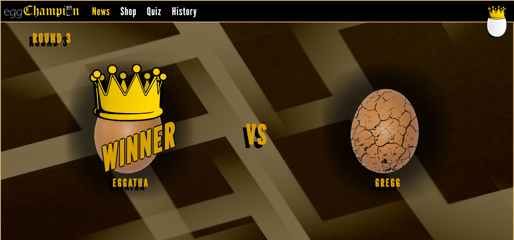
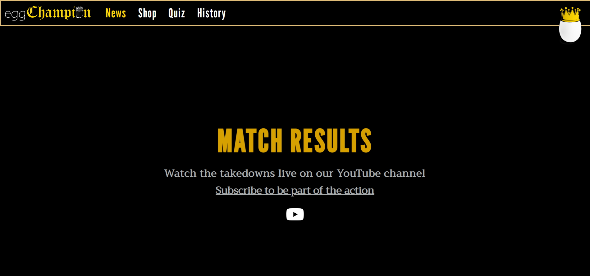
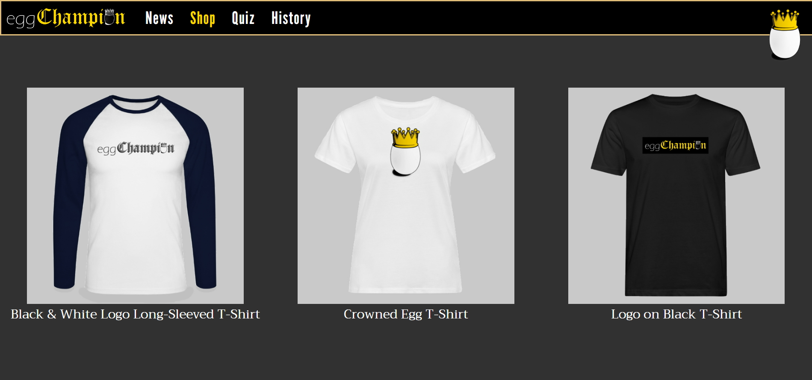
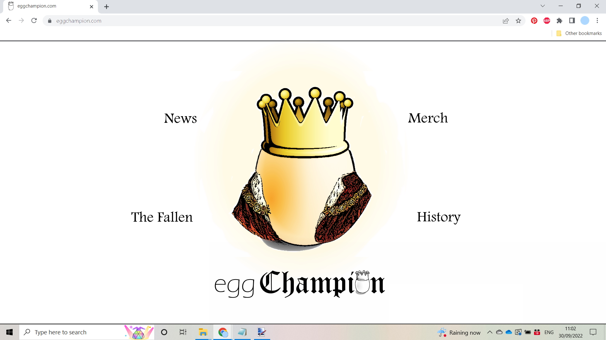
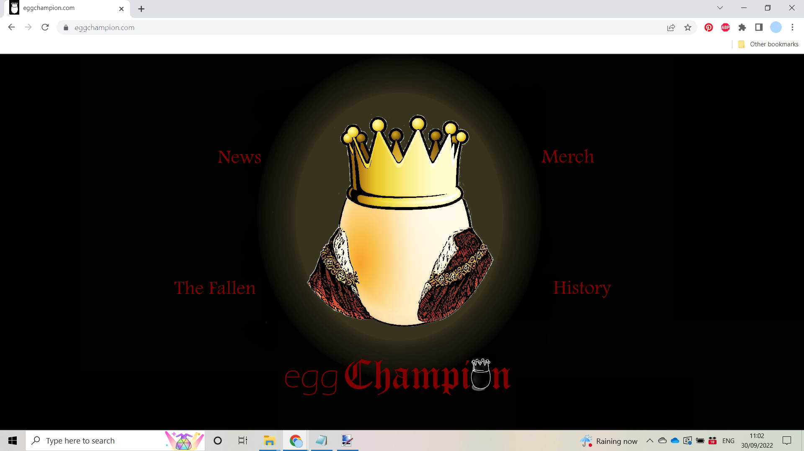
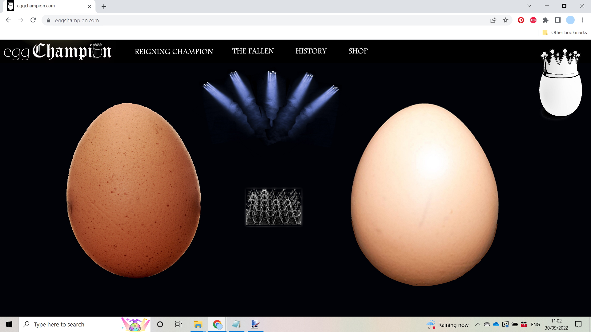
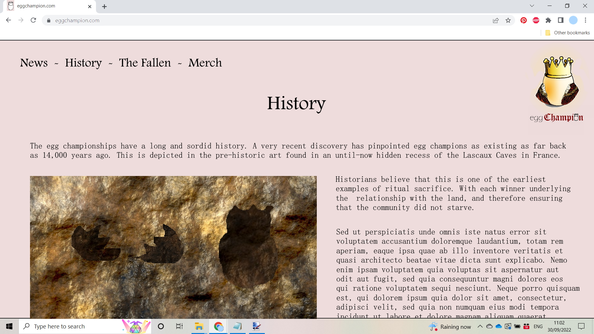
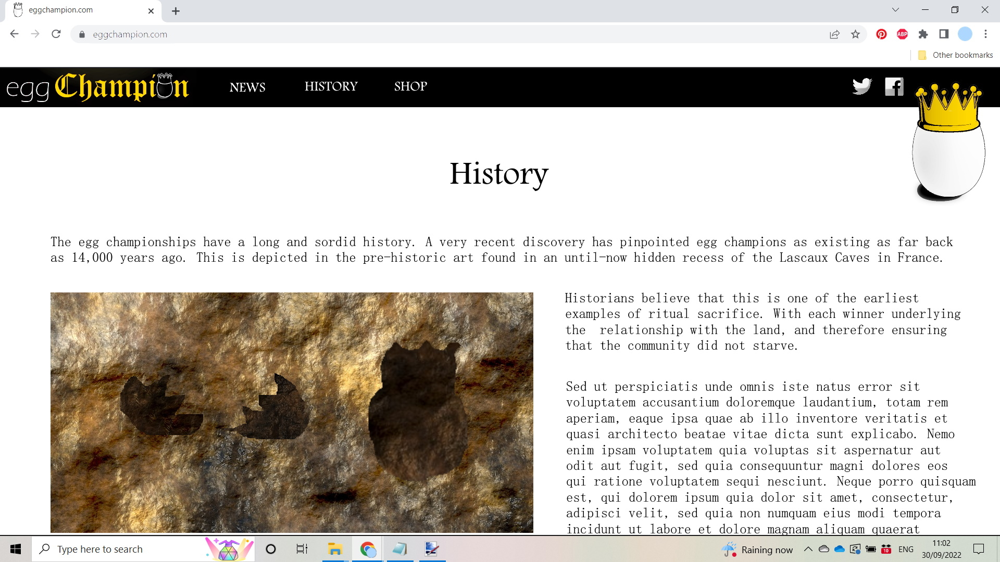
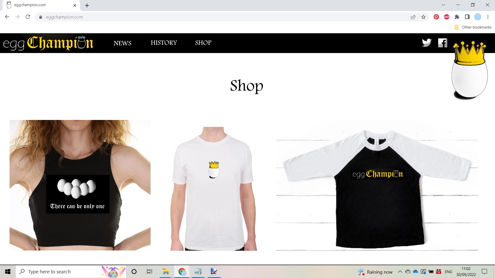

# Egg Champion Website

This website was created for a fictional sport called Egg Champion. It gives up-to-date news on which egg is the current champion, history of the sport, a shop where fans can buy merchandise, and a quiz about eggs. It has been designed with a range of different screen sizes in mind. 

[View the live project here](https://lithill.github.io/New-Egg-Champion-Website/)

## Table of Contents

1. [User Experience](#user-experience)
3. [Design](#design)
4. [Features](#features)
5. [Accessibility](#accessibility)
6. [Technologies Used](#technologies-used)
7. [Deployment and Local Development](#deployment-and-local-development)
8. [Testing](#testing)
9. [Credits](#credits)

## User Experience

### Initial Discussion

Egg Champion is a world-wide sport with a rich history. The championship is held each weekend. The Egg Champion website is primarily a place for fans to find the latest fight information, buy merchandise and find the links to the live championship on YouTube.

#### Key information for the site

* Who is the reigning egg champion.
* When is the next fight.
* Where can you watch the next fight.
* How to buy merchandise.
* What is the history of the egg championship.

### User Stories

#### Client Goals

* To be able to view the site on a range of device sizes.
* To make it easy for potential fans to find out:
    * Who the reigning champion is
    
    * And how to watch the next fight live. 
    
    
* To sell egg champion merchandise to fans.

#### First Time Visitor Goals

* I want to find out about the egg championship. (Please note that the details of the exact workings of this sport are intentionally vague, as this is a spoof site, and it was felt that keeping this a mystery would be funnier. During testing, the developer was asked by several testers "Is this a real sport?")
* I want to be able to navigate the site easily to find information.
* I want to be able to find their YouTube channel and other social media accounts.

#### Returning Visitor Goals

* I want to find up-to-date information about the recent egg fights.
* I want to find out when the next egg fight is and how to watch it.

#### Frequent Visitor Goals

* I want to buy merchandise. 

## Design

### Early Design Phases

A few designs were considered before choosing the final one. The index page has the most early-design variations, as this was the first page that was considered: 

 

The history page had fewer early design variations:

The shop page was one of the last designed, so only has one early variation. It was decided that the phrase "There can be only one" could not be used on the website, as it is from Highlander:

I took inspiration from the [MMA Fighting]( https://www.mmafighting.com/) website's navigation bar. Which you can see influenced the design in the later versions.

I continued refining the design as I made the website, e.g., shrinking the egg in the right-hand corner, and making a footer for the social media icons. Therefore, I do not have any images that show the final design. 

### Colour Scheme

The website uses a palette of colours that were based on the image of a gold crown on a black background, as seen in index page version 3. It was decided that the site should feel important, mysterious, and slightly dangerous, and that this colour palette would lend itself to this. 

### Typography

Google Fonts was used for the following fonts:

* Trirong is used for the body text on the site. It is a serif font.
* League Gothic is used for headings on the site. It is a sans-serif font.

### Media

- The two Egg Champion logos in the menu bar were created by the developer, using Paint.net.
- The egg timer photograph used on the history page was taken and edited by Jordan Benton and found on [Pexels](https://www.pexels.com/photo/shallow-focus-photography-of-hourglass-1095602/). 
- The egg crack overlay used on the News page was created by b0red, and found on [Pixabay](https://pixabay.com/vectors/crack-overlay-distress-effect-2147059/)
- The image for the News page background was created by Edward Jenner and found on [Pexels](https://www.pexels.com/photo/multiple-overlay-patterns-of-monochrome-design-4252890/). The developer edited the colours using paint.net.
- Replacement merchandise pictures were generated through [Spreadshirt](https://www.spreadshirt.co.uk).
- [Dall-E 2](https://openai.com/dall-e-2/) was used to create the rest of the artwork.
- The video was made by the developer, using [InVideo](https://invideo.io/).

## Features

The website is comprised of six pages, five of which are accessible from the navigation menu (home page, news, shop, quiz, history). The fifth page is a thank you page which appears once a user submits the form on the quiz page. 

* All pages on the website have:

    * A responsive navigation bar at the top which allows the user to navigate through the site. To the left of the navigation bar is an image of the Egg Champion logo in text form. This logo is clickable and takes the user to the home page. To the right of the text logo are links to the websites' pages (news, shop, quiz, history). To the right of these links there is a second logo. To allow a good user experience of the site the right logo replaces the left logo on mobile devices. The right logo then becomes a link to the homepage. This is to make the navigation bar fit smaller screens better.
    * A footer which contains social media icon links to Facebook, Twitter, YouTube, and Instagram. Icons were used to keep the footer clean and because they are universally recognisable.

* Home Page:

    * Teaser images and text, used to build excitement and anticipation.
    
    * Video trailer for the upcoming championship battle. 

* News Page:

    * Link to the Egg Champion YouTube channel. 
    * Information about the most-recent Egg Champion fight results. 

* Shop Page:

    * Motivation for buying Egg Champion merchandise.
     
    * Merchandise links that take the user to the Egg Champion [Zazzle Shop](https://www.zazzle.co.uk/store/egg_champion).

* Quiz Page:

    * A fun and definitely factual quiz about eggs, which gives the user the chance to win an egg champion action figure. (Robe, crown, and egg not included.)

* History Page:

    * An article about the history of the Egg Championship.
     

* Thankyou Page:

    * Providing the objectively factual answers to the egg quiz. 
     

* Future Implementations:

    * Use JavaScript to create a fight scroll animation on the News Page.
    * Include images on history page that become full screen when you click on them.

## Accessibility

I have been mindful during coding to ensure that the website is as accessible friendly as possible. I have achieved this by:

* Using semantic HTML.
* Using descriptive alt attributes on images on the site.
* Providing information for screen readers where there are icons used and no text, such as footer icons.
* Guaranteeing adequate colour contrast throughout the site.
* Making menus accessible by marking the current page as current for screen readers.

## Technologies Used

### Languages Used

HTML5 and CSS3 were used to create this website.

### Frameworks, Libraries & Programs Used

- [Google Fonts](https://fonts.google.com/) was used to import IM Fell Double Pica, Trirong, and League Gothic.
- [Font Awesome](https://fontawesome.com/) was used on the footer for the social media icons.
- [Replit](https://replit.com/) was used as the main programme to write the code, which was then sent to GitHub for version control. The reader can see the [Replit version here](https://replit.com/@RossHamilton/New-Egg-Champion-Website#index.html).
- [Git](https://git-scm.com/) was used for version control by using the Gitpod terminal to commit to Git and Push to GitHub.
- [GitHub](https://github.com/) was used to store the project's code after being pushed from Replit, and to handle version control.
- [Paint.Net](https://www.getpaint.net/download.html) was used to create the logos on each corner of the header.
- [InVideo](https://invideo.io/) was used to create the video on the index page. 
- [YouTube](https://www.youtube.com/) was used to host the video.
- [Zazzle](https://www.zazzle.co.uk/) was used to create functioning merchandise links.
- [Google Dev Tools](https://developer.chrome.com/docs/devtools/) was used to troubleshoot and test features and solve issues with responsiveness and styling.
- [Am I Responsive?](https://ui.dev/amiresponsive) was used to show the website image on a range of devices.
- [Any WEBP](https://anywebp.com/) was used to convert website images into webp format.
- [Tiny PNG](https://tinypng.com/) was used to compress website images without losing quality.
  
## Deployment and Local Development

### Deployment

This project was deployed to GitHub Pages using the following steps:

1. Log into GitHub and locate the [GitHub Repository](https://github.com/Lithill/New-Egg-Champion-Website).
2. Click the settings button (above the "add file" button).
3. Click on "Pages" on the left-hand-side column.
4. Under "Source", click the dropdown called "Main", select folder ""/root”, and click "save".
5. Refresh the page.
6. Click on the "Visit site" button at the top of the page.

### Local Deployment

#### How to Fork

To fork the New-Egg-Champion-Website repository:

1) Log in (or sign up) to GitHub.
2) Go to the repository for this project, Lithill/New-Egg-Champion-Website.
3) Click the Fork button in the top right corner.

#### How to Clone

To clone the New-Egg-Champion-Website repository:

1) Log in (or sign up) to GitHub.
2) Go to the repository for this project, Lithill/New-Egg-Champion-Website.
3) Above the list of files, click "Code".
4) Click "Open with GitHub Desktop" to clone and open the repository with GitHub Desktop.
5) Click "Choose..." and, using Windows Explorer, navigate to a local path where you want to clone the repository.
6) Click "Clone".
   
## Testing

Testing was ongoing throughout the entire build. I utilised Chrome developer tools while building to pinpoint and troubleshoot any issues as I went along.

### W3C Validator

The [W3C HTML Validator](https://validator.w3.org/) was used to validate the HTML on all pages of the website. The [W3C CSS Validator](https://jigsaw.w3.org/css-validator/) was used to validate CSS in the style.css file.

* [Index Page HTML](assets/images/html-checker-index.png)
* [News Page HTML](assets/images/html-checker-news.png)
* [Shop Page HTML](assets/images/html-checker-shop.png)
* [Quiz Page HTML](assets/images/html-checker-quiz.png)
* [History Page HTML](assets/images/html-checker-history.png)
* [Thank You Page HTML](assets/images/html-checker-thankyou.png)
* [Stylesheet CSS](assets/images/html-checker-css.png)

### Solved Bugs

1) 
    1) Expected behaviour: Left logo contained in navigation bar.
    2) Actual behaviour: Left logo overspilling navigation bar.
    3) Solution: Set the left-logo image height to 100% and edited line-height to compensate. 
    
2)
    1) Expected behaviour: Top of first div image in line with the bottom of the navigation bar.
    2) Actual behaviour: Top of first div image hidden under navigation bar.
    3) Solution: Changed header height to pixels and set the same number of pixels as margin-top for first div image.

3)
    1) Expected behaviour: Footer sitting at bottom of the page.
    2) Actual behaviour: Footer riding up and leaving a gap at the bottom of the page. 
    3) Solution: Decrease the margin on the social network class.

4)
    1) Expected behaviour: Current page's menu link highlighted in yellow.
    2) Actual behaviour: Current page's menu link the same colour as the rest.
    3) Solution: 'Active' class was being overridden by "menu s"'s in the CSS. Took text colour out of "menu a" and created a "not-active" class to use instead to apply to all other header links. 

5)
    1) Expected behaviour: "It Takes" text on index page looks centred. 
    2) Actual behaviour: "It Takes" text on index page does not look centred. 
    3) Solution: Edit image directly above it so that the image is centred. White space was uneven. 

6)
    1) Expected behaviour: Video becomes full screen when mobile is rotated. 
    2) Actual behaviour: Video does not become full screen when mobile is rotated. 
    3) Solution: Re-copy and paste code from YouTube. 

7)
    1) Expected behaviour: Sharp images on Zazzle products.
    2) Actual behaviour: Blurry images on Zazzle products.
    3) Solution: Used [Spreadshirt](https://www.spreadshirt.co.uk/create-your-own) to create mock-up images of the merchandise to replace the Zazzle images on the Shop page.

8)
    1) Expected behaviour: Title image and text occupy their own space.
    2) Actual behaviour: Title image and text spill under navigation bar.
    3) Solution: Changed title image and text sizes to fit.

9)
    1) Expected behaviour: Title image maintains ratio.
    2) Actual behaviour: Title image becomes distorted in 912px x 1368px (Surface Pro 7).
    3) Solution: Changed the mobile media query that pushes the text under the images to start at 912px wide instead.

10)
    1) Expected behaviour: History link stay on navigation bar.
    2) Actual behaviour: History link pushed off navigation bar on narrower screen widths. 
    3) Solution: Made link text slightly smaller in mobile view. 

11)
    1) Expected behaviour: "VS" text scrolling underneath navigation bar.
    2) Actual behaviour: "VS" text scrolling over navigation bar.
    3) Solution: Added "z-index: 5;" to the CSS for the header. And "z-index: 6;" to right-logo.
    
12)
    1) Expected behaviour: User can see the heading text of the index page without scrolling down.
    2) Actual behaviour: User cannot see the heading text of the index page without scrolling down.
    3) Solution: Change width in existing media queries. 

13)
    1) Expected behaviour: Images load on Git Pages
    2) Actual behaviour: Images did not load on Git Pages
    3) Solution: Change file path type

13)
    1) Expected behaviour: No vertical scroll throughout the website
    2) Actual behaviour: Vertical scroll on index page
    3) Solution: Resize video on index page

14)
    1) Expected behaviour: Images not to overlap on news page.
    2) Actual behaviour: Images overlap on news page.
    3) Solution: Made image size based on percentage of screen width instead of pixel width.

15)
    1) Expected behaviour: Shop merchandise to be displayed in three columns side by side on wider screens.
    2) Actual behaviour: Shop merchandise displaying as one column on wider screens.
    3) Solution: Changed @media width in CSS code.

### Known Bugs

* Chevron links do not always take you to where you expect they will. This is especially apparent on Latitude 7420 with Chrome, and Gigabyte laptop with Firefox. This also needs testing on other sized screens with different browsers.
* The video seems to be having difficulty playing in Firefox.
* The Egg Champion logo in the video does not have a transparent background. Therefore, the fireworks in the background are not visible when they should be. 
* In some laptop views (Nest Hub, Nes Hub Max and Latitude 7420), you cannot see the top of the header image in the index page.
* History page egg is not centred on Galaxy Fold view.
* On Nest Hub, Nest Hub MaxTitle, title eggs spill out of frame and text overlaps on History and Shop pages. 
* Text under black and white long-sleeved t-shirt is badly spaced on shop page and does not seem to be responding to padding or margins added. 

### Lighthouse

I used Lighthouse through Chrome Developer Tools to test accessibility, performance, best practices and SEO of the website.

#### Initial Testing

##### Index Page

[Desktop](assets/images/lighthouse-desktop-index1.png) ~ [Mobile](assets/images/lighthouse-mobile-index1.png)

Recommendations:

* Desktop
    * Serve images in next-gen formats
    * Efficiently encode images
    * Ensure text remains visible during webfont load
    * Some third-party resources can be lazy loaded with a facade 
    * Does not use passive listeners to improve scrolling performance
    * Image elements do not have explicit width and height
    * Serve static assets with an efficient cache policy
    * Avoid chaining critical requests 
    * Keep request counts low and transfer sizes small 
    * Largest Contentful Paint element 
    * Avoid large layout shifts 

* Mobile
    * Serve images in next-gen formats
    * Properly size images
    * Eliminate render-blocking resources
    * Reduce unused CSS
    * Efficiently encode images
    * Enable text compression
    * Preconnect to required origins Error!
    * Preload Largest Contentful Paint image Error!
    * Serve static assets with an efficient cache policy 8 resources found
    * Ensure text remains visible during webfont load
    * Some third-party resources can be lazy loaded with a facade 
    * Does not use passive listeners to improve scrolling performance
    * Image elements do not have explicit width and height
    * Avoid enormous network payloads 
    * Avoid chaining critical requests 
    * Keep request counts low and transfer sizes small 
    * Avoid large layout shifts 
    * Avoid long main-thread tasks 

##### News Page

[Desktop](assets/images/lighthouse-desktop-news1.png) ~ [Mobile](assets/images/lighthouse-mobile-news1.png)

Recommendations:

* Desktop
    * Serve images in next-gen formats
    * Efficiently encode images
    * Properly size images
    * Eliminate render-blocking resources
    * Serve static assets with an efficient cache policy
    * Ensure text remains visible during webfont load
    * Image elements do not have explicit width and height
    * Avoid enormous network payloads 
    * Avoid chaining critical requests 
    * Keep request counts low and transfer sizes small 
    * Largest Contentful Paint element 
    * Avoid large layout shifts 

* Mobile
    * Serve images in next-gen formats
    * Efficiently encode images
    * Properly size images
    * Eliminate render-blocking resources
    * Reduce unused CSS
    * Enable text compression
    * Serve static assets with an efficient cache policy 
    * Ensure text remains visible during webfont load
    * Image elements do not have explicit width and height
    * Avoid enormous network payloads 
    * Avoid chaining critical requests 
    * Keep request counts low and transfer sizes small 
    * Largest Contentful Paint element 
    * Avoid large layout shifts 
    * Avoid long main-thread tasks

##### Shop Page

[Desktop](assets/images/lighthouse-desktop-shop1.png) ~ [Mobile](assets/images/lighthouse-mobile-shop1.png)

Recommendations:

* Desktop
    * Serve images in next-gen formats
    * Efficiently encode images
    * Eliminate render-blocking resources
    * Properly size images
    * Ensure text remains visible during webfont load
    * Image elements do not have explicit width and height
    * Serve static assets with an efficient cache policy 
    * Avoid chaining critical requests 
    * Keep request counts low and transfer sizes small
    * Largest Contentful Paint element 
    * Avoid large layout shifts 

* Mobile
    * Serve images in next-gen formats
    * Efficiently encode images
    * Eliminate render-blocking resources
    * Properly size images
    * Reduce unused CSS
    * Enable text compression
    * Ensure text remains visible during webfont load
    * Image elements do not have explicit width and height
    * Serve static assets with an efficient cache policy
    * Avoid chaining critical requests
    * Keep request counts low and transfer sizes small 
    * Largest Contentful Paint element 
    * Avoid large layout shifts
    * Avoid long main-thread tasks 

##### Quiz Page

[Desktop](assets/images/lighthouse-desktop-quiz1.png) ~ [Mobile](assets/images/lighthouse-mobile-quiz1.png)

Recommendations:

* Desktop
    * Serve images in next-gen formats
    * Efficiently encode images
    * Properly size images
    * Eliminate render-blocking resources
    * Ensure text remains visible during webfont load
    * Image elements do not have explicit width and height
    * Serve static assets with an efficient cache policy
    * Avoid chaining critical requests 
    * Keep request counts low and transfer sizes small 
    * Largest Contentful Paint element 
    * Avoid large layout shifts 

* Mobile
    * Serve images in next-gen formats
    * Efficiently encode images
    * Properly size images
    * Eliminate render-blocking resources
    * Reduce unused CSS
    * Enable text compression
    * Ensure text remains visible during webfont load
    * Image elements do not have explicit width and height
    * Serve static assets with an efficient cache policy 
    * Avoid chaining critical requests 
    * Keep request counts low and transfer sizes small 
    * Largest Contentful Paint element 
    * Avoid large layout shifts 
    * Avoid long main-thread tasks 

##### History Page

[Desktop](assets/images/lighthouse-desktop-history1.png) ~ [Mobile](assets/images/lighthouse-mobile-history1.png)

Recommendations:

* Desktop
    * Serve images in next-gen formats
    * Properly size images
    * Eliminate render-blocking resources
    * Efficiently encode images
    * Serve static assets with an efficient cache policy 
    * Ensure text remains visible during webfont load
    * Image elements do not have explicit width and height
    * Avoid enormous network payloads 
    * Avoid chaining critical requests
    * Keep request counts low and transfer sizes small 
    * Largest Contentful Paint element 
    * Avoid large layout shifts 
    
* Mobile
    * Serve images in next-gen formats
    * Properly size images
    * Efficiently encode images
    * Eliminate render-blocking resources
    * Reduce unused CSS
    * Enable text compression
    * Serve static assets with an efficient cache policy 
    * Ensure text remains visible during webfont load
    * Image elements do not have explicit width and height
    * Avoid enormous network payloads 
    * Avoid chaining critical requests
    * Keep request counts low and transfer sizes small 
    * Largest Contentful Paint element 
    * Avoid large layout shifts 
    * Avoid long main-thread tasks 

##### Thank You Page

[Desktop](assets/images/lighthouse-desktop-thankyou1.png) ~ [Mobile](assets/images/lighthouse-mobile-thankyou1.png)

Recommendations:

* Desktop
    * Properly size images
    * Eliminate render-blocking resources
    * Serve images in next-gen formats
    * Ensure text remains visible during webfont load
    * Image elements do not have explicit width and height
    * Serve static assets with an efficient cache policy
    * Avoid chaining critical requests
    * Keep request counts low and transfer sizes small 
    * Largest Contentful Paint element 
    * Avoid large layout shifts 

* Mobile
    * Properly size images
    * Serve images in next-gen formats
    * Eliminate render-blocking resources
    * Reduce unused CSS
    * Efficiently encode images
    * Enable text compression
    * Ensure text remains visible during webfont load
    * Image elements do not have explicit width and height
    * Serve static assets with an efficient cache policy 
    * Avoid chaining critical requests 
    * Keep request counts low and transfer sizes small 
    * Largest Contentful Paint element 
    * Avoid large layout shifts 
    * Avoid long main-thread tasks 

#### Fixes and Most Recent Lighthouse Testing

As advised:
* I compressed all of the website images
* I changed all website image formats to webp
* I took out all possible unused CSS code 
* Missing aria-labels were added
* The rest of the suggestions Lighthouse gave are either outside of the scope of this assignment, or outside of my ability due to hosting on Gitpod

Please find the current Lighthouse stats below for each page.

##### Index Page

[Desktop](assets/images/lighthouse-desktop-index2.png) ~ [Mobile](assets/images/lighthouse-mobile-index2.png)

##### News Page

[Desktop](assets/images/lighthouse-desktop-news2.png) ~ [Mobile](assets/images/lighthouse-mobile-news2.png)

##### Shop Page

[Desktop](assets/images/lighthouse-desktop-shop2.png) ~ [Mobile](assets/images/lighthouse-mobile-shop2.png)

##### Quiz Page

[Desktop](assets/images/lighthouse-desktop-quiz2.png) ~ [Mobile](assets/images/lighthouse-mobile-quiz2.png)

##### History Page

[Desktop](assets/images/lighthouse-desktop-history2.png) ~ [Mobile](assets/images/lighthouse-mobile-history2.png)

##### Thank You Page

[Desktop](assets/images/lighthouse-desktop-thankyou2.png) ~ [Mobile](assets/images/lighthouse-mobile-thankyou2.png)

### Full Testing

To fully test my website, I went through each page using Google Chrome Developer Tools to ensure that they responsive on all available screen sizes. Testing was performed on a variety of browsers (Chrome, Microsoft Edge and Firefox) and devices (Gigabyte gaming laptop, iPhone SE, Android 1+9 mobile, HP Compaq Elite 8300 desktop, Latitude 7420 laptop).

#### Links:

1) Test each link on the index page. Each link worked as expected on my screen width, and any links leading to external pages opened correctly in a separate browser tab. There is a known bug that sometimes the chevron link will not place the user where they expect when clicked. 
2) Test each link on the news page. Each link worked as expected on my screen width, and any links leading to external pages opened correctly in a separate browser tab. There is a known bug that sometimes the chevron link will not place the user where they expect when clicked.
3) Test each link on the shop page. Each link worked as expected on my screen width, and any links leading to external pages opened correctly in a separate browser tab. There is a known bug that sometimes the chevron link will not place the user where they expect when clicked.
4) Test each link on the quiz page. Each link worked as expected on my screen width, and any links leading to external pages opened correctly in a separate browser tab. There is a known bug that sometimes the chevron link will not place the user where they expect when clicked.
5) Test each link on the history page. Each link worked as expected on my screen width, and any links leading to external pages opened correctly in a separate browser tab. There is a known bug that sometimes the chevron link will not place the user where they expect when clicked.
6) Test each link on the thankyou page. Each link worked as expected on my screen width, and any links leading to external pages opened correctly in a separate browser tab. There is a known bug that sometimes the chevron link will not place the user where they expect when clicked.

#### Quiz Form:

1) Test the quiz form. I tried to submit the form without filling in any input fields. The form worked correctly and directed users to fill in the name field. I then chose a radio button and tried to submit the form. The form worked correctly and directed users to fill in the answer for the knock-knock joke. I then filled in both radio button and knock-knock joke. The drop-down answer is pre-filled, so users do not need to select that if they would like to submit the "100" option and adding their email address is optional. The form then opens the thank you page in the same browser window.
2) I tried to submit the form with only the knock-knock joke answer. The form then directs the user to select a radio button. Once selected, the form then opens the thank you page in the same browser window. 
## Credits

### Code Used

* I took code for the iframe-container and iframe from [w3schools](https://www.w3schools.com/howto/howto_css_responsive_iframes.asp) and [Stack Overflow](https://stackoverflow.com/questions/8366957/how-to-center-an-iframe-horizontally).
* I used table code for the quiz page (knock knock joke) found at [Stack Overflow](https://stackoverflow.com/questions/3313456/css-borders-between-table-columns-only).
* Part of the code for styling the blockquote on the history page was taken from [CSS Tricks](https://css-tricks.com/snippets/css/simple-and-nice-blockquote-styling/), [CSS Tricks (different article)](https://css-tricks.com/quoting-in-html-quotations-citations-and-blockquotes) and [Java2s](http://www.java2s.com/Code/HTMLCSS/Tags/borderforblockquote.html).
* Part of the code for wrapping text around images on the history page was taken from [Thought Co](https://www.thoughtco.com/wrapping-text-around-image-3466530#:~:text=Enter%20.,the%20text%20wraps%20around%20it)
* Code was taken from [W3Schools](https://www.w3schools.com/howto/howto_css_three_columns.asp) to create the three columns on the shop page.
* Embed code lightly edited but taken from [Zazzle](https://zazzle.co.uk) and [YouTube](https://www.youtube.com/)

### Content

Content for the website was written by Rossanne Hamilton.

### Media

* The egg timer photograph used on the history page was taken and edited by Jordan Benton and found on [Pexels](https://www.pexels.com/photo/shallow-focus-photography-of-hourglass-1095602/). 
* The egg crack overlay used on the News page was created by b0red and found on [Pixabay](https://pixabay.com/vectors/crack-overlay-distress-effect-2147059/).
* The image for the News page background was created by Edward Jenner and found on [Pexels](https://www.pexels.com/photo/multiple-overlay-patterns-of-monochrome-design-4252890/). The developer edited the colours using paint.net.
* Replacement merchandise pictures were generated through [Spreadshirt](www.spreadshirt.co.uk).

### Acknowledgements

I would like to acknowledge the following people who helped me along the way in completing my first milestone project:

- My tutor Robert Mclaughlin for helpful feedback and sharing links for further learning.
- My mentor Mitko Bachvarov for helpful feedback and sharing links for further learning.
