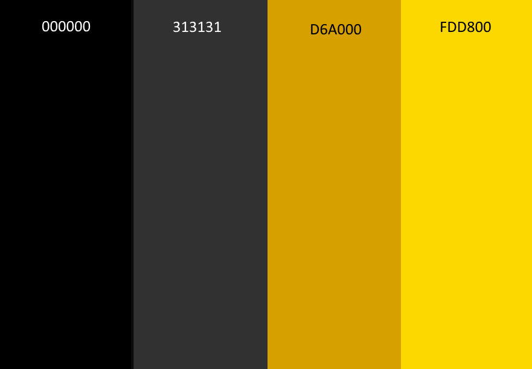

# Egg Champion Website

This website was created for a fictional sport called Egg Champion. It gives up-to-date news on which egg is the current champion, history of the sport, a shop where fans can buy merchandise, and a quiz about eggs. It has been designed with a range of different screen sizes in mind. 

[View the live project here](https://lithill.github.io/New-Egg-Champion-Website/)

## Table of Contents

1. [User Experience](#user-experience)
3. [Design](#design)
4. [Features](#features)
5. [Accessibility](#accessibility)
6. [Technologies Used](#technologies-used)
7. [Deployment and Local Development](#deployment-and-local-development)
8. [Testing](#testing)
9. [Credits](#credits)

## User Experience

### Initial Discussion

Egg Champion is a world-wide sport with a rich history. The championship is held each weekend. The Egg Champion website is primarily a place for fans to find the latest fight information, buy merchandise and find the links to the live championship on YouTube.

#### Key information for the site

* Who is the reigning egg champion.
* When is the next fight.
* Where can you watch the next fight.
* How to buy merchandise.
* What is the history of the egg championship.

### User Stories

#### Client Goals

* To be able to view the site on a range of device sizes.
* To make it easy for potential fans to find out:
    * who the reigning champion is
    
    * and how to watch the next fight live. 
    
    
* To sell egg champion merchandise to fans.

#### First Time Visitor Goals

* I want to find out about the egg championship. (Please note that the details of the exact workings of this sport are intentionally vague, as this is a spoof site, and it was felt that keeping this a mystery would be funnier. During testing, the developer was asked by several testers "Is this a real sport?")
* I want to be able to navigate the site easily to find information.
* I want to be able to find their YouTube channel and other social media accounts.

#### Returning Visitor Goals

* I want to find up-to-date information about the recent egg fights.
* I want to find out when the next egg fight is and how to watch it.

#### Frequent Visitor Goals

* I want to buy merchandise. 

## Design

### Early Design Phases

A few designs were considered before choosing the final one. The index page has the most early-design variations, as this was the first page that was considered: 

 

The history page had fewer early design variations:

The shop page was one of the last designed, so only has one early variation. It was decided that the phrase "There can be only one" could not be used on the website, as it is from Highlander:

I took inspiration from the [MMA Fighting](	https://www.mmafighting.com/) website's navigation bar. Which you can see influenced the design in the later versions.

I continued refining the design as I made the website, e.g., shrinking the egg in the right-hand corner, and making a footer for the social media icons. Therefore, I do not have any images that show the final design. 

### Colour Scheme

The website uses a palette of colours that were based on the image of a gold crown on a black background, as seen in index page version 3. It was decided that the site should feel important, mysterious, and slightly dangerous, and that this colour palette would lend itself to this. 

### Typography

Google Fonts was used for the following fonts:

* Trirong is used for the body text on the site. It is a serif font.
* League Gothic is used for headings on the site. It is a sans-serif font.

### Media

- The two Egg Champion logos in the menu bar were created by the developer, using Paint.net.
- The egg timer photograph used on the history page was taken and edited by Jordan Benton and found on [Pexels](https://www.pexels.com/photo/shallow-focus-photography-of-hourglass-1095602/). 
- The egg crack overlay used on the News page was created by b0red, and found on [Pixabay](https://pixabay.com/vectors/crack-overlay-distress-effect-2147059/)
- The image for the News page background was created by Edward Jenner and found on [Pexels](https://www.pexels.com/photo/multiple-overlay-patterns-of-monochrome-design-4252890/). The developer edited the colours using paint.net.
- Replacement merchandise pictures were generated through [Spreadshirt](www.spreadshirt.co.uk).
- [Dall-E 2](https://openai.com/dall-e-2/) was used to create the rest of the artwork.
- The video was made by the developer, using [InVideo](https://invideo.io/).

## Features

The website is comprised of six pages, five of which are accessible from the navigation menu (home page, news, shop, quiz, history). The fifth page is a thank you page which appears once a user submits the form on the quiz page. 

* All pages on the website have:

    * A responsive navigation bar at the top which allows the user to navigate through the site. To the left of the navigation bar is an image of the Egg Champion logo in text form. This logo is clickable and takes the user to the home page. To the right of the text logo are links to the websites' pages (news, shop, quiz, history). To the right of these links there is a second logo. To allow a good user experience of the site the right logo replaces the left logo on mobile devices. The right logo then becomes a link to the homepage. This is to make the navigation bar fit smaller screens better.
    * A footer which contains social media icon links to Facebook, Twitter, YouTube, and Instagram. Icons were used to keep the footer clean and because they are universally recognisable.

* Home Page:

    * Teaser images and text, used to build excitement and anticipation.
    * Video trailer for the upcoming championship battle. 

* News Page:

    * Link to the Egg Champion YouTube channel.
    * Information about the most-recent Egg Champion fight results.

* Shop Page:

    * Motivation for buying Egg Champion merchandise.
    * Merchandise links that take the user to the Egg Champion [Zazzle Shop](https://www.zazzle.co.uk/store/egg_champion).

* Quiz Page:

    * A fun and definitely factual quiz about eggs, which gives the user the chance to win an egg champion action figure. (Robe, crown, and egg not included.)

* History Page:

    * An article about the history of the Egg Championship. 

* Thankyou Page:

    * Providing the objectively factual answers to the egg quiz. 

* Future Implementations:

    * Use JavaScript to create a fight scroll animation on the News Page.
    * Include images on history page that go full screen when you click on them.

## Accessibility

I have been mindful during coding to ensure that the website is as accessible friendly as possible. I have achieved this by:

* Using semantic HTML.
* Using descriptive alt attributes on images on the site.
* Providing information for screen readers where there are icons used and no text, such as footer icons.
* Guaranteeing adequate colour contrast throughout the site.
* Making menus accessible by marking the current page as current for screen readers.

## Technologies Used

### Languages Used

HTML5 and CSS3 were used to create this website.

### Frameworks, Libraries & Programs Used

- [Google Fonts](https://fonts.google.com/) was used to import IM Fell Double Pica, Trirong, and League Gothic.
- [Font Awesome](https://fontawesome.com/) was used on the footer for the social media icons.
- [Replit](replit.com) was used as the main programme to write the code, which was then sent to GitHub for version control. The reader can see the [Replit version here](https://replit.com/@RossHamilton/New-Egg-Champion-Website#index.html).
- [Git](https://git-scm.com/) was used for version control by using the Gitpod terminal to commit to Git and Push to GitHub.
- [GitHub](https://github.com/) was used to store the project's code after being pushed from Replit, and to handle version control.
- [Paint.Net](https://www.getpaint.net/download.html) was used to create the logos on each corner of the header.
- [InVideo](https://invideo.io/) was used to create the video on the index page. 
- [YouTube](https://www.youtube.com/) was used to host the video.
- [Zazzle](https://www.zazzle.co.uk/) was used to create functioning merchandise links.
- [Google Dev Tools](https://developer.chrome.com/docs/devtools/) was used to troubleshoot and test features and solve issues with responsiveness and styling.
- [Am I Responsive?](https://ui.dev/amiresponsive) was used to show the website image on a range of devices.
- [Any WEBP](https://anywebp.com/) was used to convert website images into webp format.
- [Tiny PNG](https://tinypng.com/) was used to compress website images without losing quality.
  
## Deployment and Local Development

### Deployment

This project was deployed to GitHub Pages using the following steps:

1. Log into GitHub and locate the [GitHub Repository](https://github.com/Lithill/New-Egg-Champion-Website).
2. Click the settings button (above the "add file" button).
3. Click on "Pages" on the left-hand-side column.
4. Under "Source", click the dropdown called "Main", select folder ""/root”, and click "save".
5. Refresh the page.
6. Click on the "Visit site" button at the top of the page.

### Local Deployment

#### How to Fork

To fork the New-Egg-Champion-Website repository:

1) Log in (or sign up) to GitHub.
2) Go to the repository for this project, Lithill/New-Egg-Champion-Website.
3) Click the Fork button in the top right corner.

#### How to Clone

To clone the New-Egg-Champion-Website repository:

1) Log in (or sign up) to GitHub.
2) Go to the repository for this project, Lithill/New-Egg-Champion-Website.
3) Above the list of files, click "Code".
4) Click "Open with GitHub Desktop" to clone and open the repository with GitHub Desktop.
5) Click "Choose..." and, using Windows Explorer, navigate to a local path where you want to clone the repository.
6) Click "Clone".
   
## Testing

Testing was ongoing throughout the entire build. I utilised Chrome developer tools while building to pinpoint and troubleshoot any issues as I went along.

The following issues were raised by my tutor as feedforward:

* There was a lack of control around font sizes. Font sizes have now been more clearly defined throughout the site. 
* The article on the history page was difficult to read. Padding was added to make the column thinner that was used for the article. 

The following issues were raised during my mid project meeting with my mentor:

* The file path for images did not work when accessed through GitPages. The file path has been changed to fix this.
* The video on the homepage was too large on mobile view and created a vertical scroll. It has since been resized.
* The links on the navigation bar overspilled on smaller mobile views. The links have been made smaller so that this does not happen.
* It was felt that users would expect the chevrons to be clickable. This has been implemented. 
* Images on the news page were not responsive and overlapped each other on smaller screens. They have now been made a percentage of the screen width to overcome this. 
* Images from the Zazzle embed code were blurry. Images were created on Spreadshirt instead to be used.
* Heading titles and images were too spaced out in mobile view. This was the effect of using a background image, so the code was re-written to use an image instead.
* Heading images did not centre in mobile view. This has been rectified. 
* Spacing on the egg quiz form needed improving. This has now been done.
* The quiz needed a thank you page. This has been created and linked to the form submission button.
* Spacing was too wide between images and text on the history page. This has now been changed.
  
The following issues were raised by friends and family who helped to test the website:

* The "vs" text on the news page goes over the navigation bar when scrolling down the page. This has now been fixed.
* Clicking on chevron navigation links will not scroll to the expected areas of a page on a Latitude 7420 laptop (Display resolution 1920x1280 pixels). This will be fixed in a future update.
* The index page does not display "Have They" text without scrolling down on a Latitude 7420 laptop. This will be fixed in a future update.

### W3C Validator

The [W3C HTML Validator](https://validator.w3.org/) was used to validate the HTML on all pages of the website. The [W3C CSS Validator](https://jigsaw.w3.org/) was used to validate CSS in the style.css file.

* [Index Page HTML](assets/images/html-checker-index.png)
* [News Page HTML](assets/images/html-checker-news.png)
* [Shop Page HTML](assets/images/html-checker-shop.png)
* [Quiz Page HTML](assets/images/html-checker-quiz.png)
* [History Page HTML](assets/images/html-checker-history.png)
* [Thank You Page HTML](assets/images/html-checker-thankyou.png)
* [Stylesheet CSS](assets/images/html-checker-css.png)

### Solved Bugs

1) The Egg Champion left logo would not change size via pixel width in CSS. So, I put the id in the "img" rather than "a".

2) Left logo was overspilling header. Tried overflow: hidden, and z-index but these did not work.
	
	#left-logo {
		height: auto;
		width: 250px;
		float: left;
		z-index: 1;
		overflow: hidden;
	}

I also tried giving header z-index 2 and that didn't work.

Then I thought that it may be because of the relationship between the header and the image, so I set the left-logo image height to 100% and that worked. But then the rest of the nav words are out of line, so I needed to change their line-height.

3) I needed to change the header height to pixels rather than % so that I could set the margin-top correctly for the 1st image on the index page to remove gaps or hiding of the image. This meant I also needed to change the line-height of the text again. 

4) I could not seem to centre the text on big-egg-3. I tried text-align, and margin-left & right auto. These did not work, so I used right: 38%; instead.

5) The index page needed a payoff, so I made a video. I had difficulty getting video to show. This website helped - [Free Code Camp](https://forum.freecodecamp.org/t/youtube-refused-to-connect/245262). I then had difficulties with sizing and used this as I wanted it full screen - [Stack Overflow](https://stackoverflow.com/questions/24157940/iframe-height-auto-css). But it was too big, and text got missed out when you played it. Nothing I tried worked out, so I made a div to fit the video to. Ended up doing this, but it was not responsive:

 .container {
    width: 100vi;
    height: 655px;
 }

 .video {
	 height: 100%;
	 width: 100%;
 }

6) I used the love running footer as the basis for my footer. I was having trouble with white space under footer. I read this - [Stack Overflow](https://stackoverflow.com/questions/54836610/why-is-the-background-color-of-my-footer-not-filling-my-entire-footer) and changed my background colour. But then when I put the height to 60px, the border rode up. Debugged in chrome and figured out it was the margin on the social network class.

7) I wanted the menu link of the page you are on to be yellow. But the 'active' class was being overridden by "menu a"'s text colour. Making it an id did not work. So, I took the text colour out of "menu a" and created a "not-active" class where the text is white and applied that to all other header links. 

8) Mobile fix for header - I created a new link image in the header and turned off display when not in mobile view. This is how I switched logo images in mobile view.

9) I wanted the heading images and titles to fill the screen. I tested them on a larger screen, and they looked messy. So, I changed the image code to 100vh instead of width 100%. 

10) I fixed the positioning for the index page. I found code on [Stack Overflow](https://stackoverflow.com/questions/45641440/vertically-center-content-in-a-vh-height-div), which helped me to vertically centre the text in the "It Takes" div.
   
11) I realised the "It Takes" section did not look centred because the image it was below was not centred. I edited the image so that the file itself was centred.

12) The video did not behave as expected in mobile view. It did not become full screen when the phone was rotated, so I found the code on [YouTube](https://support.google.com/youtube/answer/171780?hl=en). I must have previously edited this part of the code out.

13) Found out how to create text-shadow via CSS at [MDN Web Docs](https://developer.mozilla.org/en-US/docs/Web/CSS/text-shadow). I used this on the news page. 
    
14) The video on the home page was too big for the container in tablet and mobile views. This resulted in a side scroll appearing at narrower screen widths. I used chrome developer tools to confirm that the video was the culprit. I pasted a fresh embed code from YouTube, and then used code from [w3schools](https://www.w3schools.com/howto/howto_css_responsive_iframes.asp) to make the video responsive. This removed the side-scroll. I then wanted to make the video smaller, but noticed that when I did, it was no longer centred. I fixed it by using code I found from [Stack Overflow](https://stackoverflow.com/questions/8366957/how-to-center-an-iframe-horizontally)
    
15) Improved legibility of news page fight information, as users found the images confusing. I used the following sources to help with this code: [Stack Overflow for outlining](https://stackoverflow.com/questions/4772906/css-is-it-possible-to-add-a-black-outline-around-each-character-in-text), [w3schools for centering text over an image](https://www.w3schools.com/howto/howto_css_image_text.asp), and [CodePen](https://codepen.io/gylidian/pen/zyabWX) for slanting text.
    
16) The images from the Zazzle embed code were blurry. I tried to get better images from the Zazzle website but could not. Instead, I used [Spreadshirt](https://www.spreadshirt.co.uk/create-your-own) to create mock-up images of the merchandise to replace the Zazzle images on the Shop page.

17) There was too much space between title images and text in longer mobile views, which was difficult to lessen when the image was a background. So, I switched the background-image to an image when the screen hit a lower width. I later decided this made the code unnecessarily complex and made the title image all images instead of background-images.
    
18) When testing on my iPhone SE, I noticed this new method made the title image and text spill under navigation bars. So, I changed the title image and text sizes to fit. 
    
19) When testing all mobile sizes in chrome developer tools, I noticed that the title image became distorted in 912px x 1368px (Surface Pro 7). So, I changed the mobile media query that pushes the text under the images to start at 912px wide instead.
    
20) When testing all mobile sizes in chrome developer tools, I noticed that the history link is pushed off the navigation bar in the Galaxy Fold view. So, I made the link text slightly smaller in mobile view.
    
21) I added customisation for quiz radio buttons with code from [Useful Angle](https://usefulangle.com/post/389/css-radio-button-color).

22) Attempted to slim down YouTube html embed code. But I was not able to find information about how to turn the following into CSS - "allow="accelerometer; autoplay; clipboard-write; encrypted-media; gyroscope; picture-in-picture" allowfullscreen".
    
23) "VS" text on news page was appearing over the header when scrolling down the page. I fixed this by adding "z-index: 5;" to the CSS for the header.

24) When I changed the right-logo to webp format, it disappeared in desktop view, but not in mobile view. This is because I forgot to change the format in the stylesheet too.

### Known Bugs

* I could not find a way to include image caption on wrapped image, so I removed the caption.
* In some laptop views (Nest Hub, Nes Hub Max and Latitude 7420), you cannot see the heading text of the index page without scrolling down.
* Chevron links do not always take you to where you expect they will on Latitude 7420 with Chrome, and Gigabyte laptop with Firefox. This also needs testing on other sized screens with different browsers.
* The video seems to be having difficulty playing in Firefox.
* The navigation bar does not have a border on its' right side.
* The Egg Champion logo in the video does not have a transparent background. Therefore the fireworks in the background are not visible when they should be. 

### Lighthouse

I used Lighthouse through Chrome Developer Tools to test accessibility, performance, best practices and SEO of the website.

#### Index Page

Initial testing: [Desktop](assets/images/lighthouse-desktop-index1.png) ~ [Mobile](assets/images/lighthouse-mobile-index1.png)

Recommendations:

* Desktop
    * Serve images in next-gen formats
    * Efficiently encode images
    * Ensure text remains visible during webfont load
    * Some third-party resources can be lazy loaded with a facade 
    * Does not use passive listeners to improve scrolling performance
    * Image elements do not have explicit width and height
    * Serve static assets with an efficient cache policy
    * Avoid chaining critical requests 
    * Keep request counts low and transfer sizes small 
    * Largest Contentful Paint element 
    * Avoid large layout shifts 

* Mobile
    * Serve images in next-gen formats
    * Properly size images
    * Eliminate render-blocking resources
    * Reduce unused CSS
    * Efficiently encode images
    * Enable text compression
    * Preconnect to required origins Error!
    * Preload Largest Contentful Paint image Error!
    * Serve static assets with an efficient cache policy 8 resources found
    * Ensure text remains visible during webfont load
    * Some third-party resources can be lazy loaded with a facade 
    * Does not use passive listeners to improve scrolling performance
    * Image elements do not have explicit width and height
    * Avoid enormous network payloads 
    * Avoid chaining critical requests 
    * Keep request counts low and transfer sizes small 
    * Avoid large layout shifts 
    * Avoid long main-thread tasks 

#### News Page

Initial testing: [Desktop](assets/images/lighthouse-desktop-news1.png) ~ [Mobile](assets/images/lighthouse-mobile-news1.png)

Recommendations:

* Desktop
    * Serve images in next-gen formats
    * Efficiently encode images
    * Properly size images
    * Eliminate render-blocking resources
    * Serve static assets with an efficient cache policy
    * Ensure text remains visible during webfont load
    * Image elements do not have explicit width and height
    * Avoid enormous network payloads 
    * Avoid chaining critical requests 
    * Keep request counts low and transfer sizes small 
    * Largest Contentful Paint element 
    * Avoid large layout shifts 

* Mobile
    * Serve images in next-gen formats
    * Efficiently encode images
    * Properly size images
    * Eliminate render-blocking resources
    * Reduce unused CSS
    * Enable text compression
    * Serve static assets with an efficient cache policy 
    * Ensure text remains visible during webfont load
    * Image elements do not have explicit width and height
    * Avoid enormous network payloads 
    * Avoid chaining critical requests 
    * Keep request counts low and transfer sizes small 
    * Largest Contentful Paint element 
    * Avoid large layout shifts 
    * Avoid long main-thread tasks

#### Shop Page

Initial testing: [Desktop](assets/images/lighthouse-desktop-shop1.png) ~ [Mobile](assets/images/lighthouse-mobile-shop1.png)

Recommendations:

* Desktop
    * Serve images in next-gen formats
    * Efficiently encode images
    * Eliminate render-blocking resources
    * Properly size images
    * Ensure text remains visible during webfont load
    * Image elements do not have explicit width and height
    * Serve static assets with an efficient cache policy 
    * Avoid chaining critical requests 
    * Keep request counts low and transfer sizes small
    * Largest Contentful Paint element 
    * Avoid large layout shifts 

* Mobile
    * Serve images in next-gen formats
    * Efficiently encode images
    * Eliminate render-blocking resources
    * Properly size images
    * Reduce unused CSS
    * Enable text compression
    * Ensure text remains visible during webfont load
    * Image elements do not have explicit width and height
    * Serve static assets with an efficient cache policy
    * Avoid chaining critical requests
    * Keep request counts low and transfer sizes small 
    * Largest Contentful Paint element 
    * Avoid large layout shifts
    * Avoid long main-thread tasks 

#### Quiz Page

Initial testing: [Desktop](assets/images/lighthouse-desktop-quiz1.png) ~ [Mobile](assets/images/lighthouse-mobile-quiz1.png)

Recommendations:

* Desktop
    * Serve images in next-gen formats
    * Efficiently encode images
    * Properly size images
    * Eliminate render-blocking resources
    * Ensure text remains visible during webfont load
    * Image elements do not have explicit width and height
    * Serve static assets with an efficient cache policy
    * Avoid chaining critical requests 
    * Keep request counts low and transfer sizes small 
    * Largest Contentful Paint element 
    * Avoid large layout shifts 

* Mobile
    * Serve images in next-gen formats
    * Efficiently encode images
    * Properly size images
    * Eliminate render-blocking resources
    * Reduce unused CSS
    * Enable text compression
    * Ensure text remains visible during webfont load
    * Image elements do not have explicit width and height
    * Serve static assets with an efficient cache policy 
    * Avoid chaining critical requests 
    * Keep request counts low and transfer sizes small 
    * Largest Contentful Paint element 
    * Avoid large layout shifts 
    * Avoid long main-thread tasks 

#### History Page

Initial testing: [Desktop](assets/images/lighthouse-desktop-history1.png) ~ [Mobile](assets/images/lighthouse-mobile-history1.png)

Recommendations:

* Desktop
    * Serve images in next-gen formats
    * Properly size images
    * Eliminate render-blocking resources
    * Efficiently encode images
    * Serve static assets with an efficient cache policy 
    * Ensure text remains visible during webfont load
    * Image elements do not have explicit width and height
    * Avoid enormous network payloads 
    * Avoid chaining critical requests
    * Keep request counts low and transfer sizes small 
    * Largest Contentful Paint element 
    * Avoid large layout shifts 
    
* Mobile
    * Serve images in next-gen formats
    * Properly size images
    * Efficiently encode images
    * Eliminate render-blocking resources
    * Reduce unused CSS
    * Enable text compression
    * Serve static assets with an efficient cache policy 
    * Ensure text remains visible during webfont load
    * Image elements do not have explicit width and height
    * Avoid enormous network payloads 
    * Avoid chaining critical requests
    * Keep request counts low and transfer sizes small 
    * Largest Contentful Paint element 
    * Avoid large layout shifts 
    * Avoid long main-thread tasks 

#### Thank You Page

Initial testing: [Desktop](assets/images/lighthouse-desktop-thankyou1.png) ~ [Mobile](assets/images/lighthouse-mobile-thankyou1.png)

Recommendations:

* Desktop
    * Properly size images
    * Eliminate render-blocking resources
    * Serve images in next-gen formats
    * Ensure text remains visible during webfont load
    * Image elements do not have explicit width and height
    * Serve static assets with an efficient cache policy
    * Avoid chaining critical requests
    * Keep request counts low and transfer sizes small 
    * Largest Contentful Paint element 
    * Avoid large layout shifts 

* Mobile
    * Properly size images
    * Serve images in next-gen formats
    * Eliminate render-blocking resources
    * Reduce unused CSS
    * Efficiently encode images
    * Enable text compression
    * Ensure text remains visible during webfont load
    * Image elements do not have explicit width and height
    * Serve static assets with an efficient cache policy 
    * Avoid chaining critical requests 
    * Keep request counts low and transfer sizes small 
    * Largest Contentful Paint element 
    * Avoid large layout shifts 
    * Avoid long main-thread tasks 

### Full Testing

To fully test my website, I went through each page using Google Chrome Developer Tools to ensure that they responsive on all available screen sizes. Testing was performed on a variety of browsers (Chrome, Microsoft Edge and Firefox) and devices (Gigabyte gaming laptop, iPhone SE, Android 1+9 mobile, HP Compaq Elite 8300 desktop, Latitude 7420 laptop).

#### Links:

1) Test each link on the index page. Each link worked as expected on my screen width, and any links leading to external pages opened correctly in a separate browser tab. There is a known bug that sometimes the chevron link will not place the user where they expect when clicked. 
2) Test each link on the news page. Each link worked as expected on my screen width, and any links leading to external pages opened correctly in a separate browser tab. There is a known bug that sometimes the chevron link will not place the user where they expect when clicked.
3) Test each link on the shop page. Each link worked as expected on my screen width, and any links leading to external pages opened correctly in a separate browser tab. There is a known bug that sometimes the chevron link will not place the user where they expect when clicked.
4) Test each link on the quiz page. Each link worked as expected on my screen width, and any links leading to external pages opened correctly in a separate browser tab. There is a known bug that sometimes the chevron link will not place the user where they expect when clicked.
5) Test each link on the history page. Each link worked as expected on my screen width, and any links leading to external pages opened correctly in a separate browser tab. There is a known bug that sometimes the chevron link will not place the user where they expect when clicked.
6) Test each link on the thankyou page. Each link worked as expected on my screen width, and any links leading to external pages opened correctly in a separate browser tab. There is a known bug that sometimes the chevron link will not place the user where they expect when clicked.

#### Quiz Form:

1) Test the quiz form. I tried to submit the form without filling in any input fields. The form worked correctly and directed users to fill in the name field. I then chose a radio button and tried to submit the form. The form worked correctly and directed users to fill in the answer for the knock-knock joke. I then filled in both radio button and knock-knock joke. The drop-down answer is pre-filled, so users do not need to select that if they would like to submit the "100" option and adding their email address is optional. The form then opens the thank you page in the same browser window.
2) I tried to submit the form with only the knock-knock joke answer. The form then directs the user to select a radio button. Once selected, the form then opens the thank you page in the same browser window. 
## Credits

### Code Used

* I took code for the iframe-container and iframe from [w3schools](https://www.w3schools.com/howto/howto_css_responsive_iframes.asp) and [Stack Overflow](https://stackoverflow.com/questions/8366957/how-to-center-an-iframe-horizontally).
* I used table code for the quiz page (knock knock joke) found at [Stack Overflow](https://stackoverflow.com/questions/3313456/css-borders-between-table-columns-only).
* Part of the code for styling the blockquote on the history page was taken from [CSS Tricks](https://css-tricks.com/snippets/css/simple-and-nice-blockquote-styling/), [CSS Tricks (different article)](https://css-tricks.com/quoting-in-html-quotations-citations-and-blockquotes) and [Java2s](http://www.java2s.com/Code/HTMLCSS/Tags/borderforblockquote.html).
* Part of the code for wrapping text around images on the history page was taken from [Thought Co](https://www.thoughtco.com/wrapping-text-around-image-3466530#:~:text=Enter%20.,the%20text%20wraps%20around%20it)
* Code was taken from [W3Schools](https://www.w3schools.com/howto/howto_css_three_columns.asp) to create the three columns on the shop page.
* Embed code lightly edited but taken from [Zazzle](https://zazzle.co.uk) and [YouTube](https://www.youtube.com/)

### Content

Content for the website was written by Rossanne Hamilton.

### Media

* The egg timer photograph used on the history page was taken and edited by Jordan Benton and found on [Pexels](https://www.pexels.com/photo/shallow-focus-photography-of-hourglass-1095602/). 
* The egg crack overlay used on the News page was created by b0red and found on [Pixabay](https://pixabay.com/vectors/crack-overlay-distress-effect-2147059/).
* The image for the News page background was created by Edward Jenner and found on [Pexels](https://www.pexels.com/photo/multiple-overlay-patterns-of-monochrome-design-4252890/). The developer edited the colours using paint.net.
* Replacement merchandise pictures were generated through [Spreadshirt](www.spreadshirt.co.uk).

### Acknowledgements

I would like to acknowledge the following people who helped me along the way in completing my first milestone project:

- My tutor Robert Mclaughlin for helpful feedback and sharing links for further learning.
- My mentor Mitko Bachvarov for helpful feedback and sharing links for further learning.